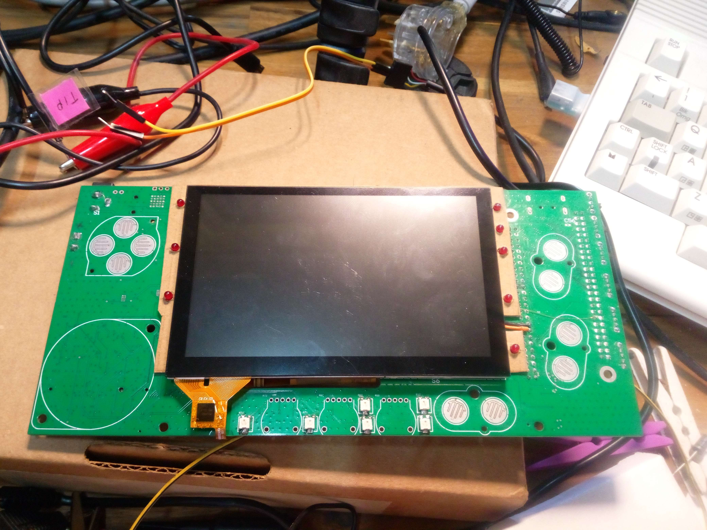

# megaphone-pcb-2020

This repository contains the PCB design for the MEGAphone R4 board.

This work was supported by the NLnet Foundation under https://nlnet.nl/project/Mega65/, for which we are extremely grateful. With their support we are very pleased to make these designs available on an open-source basis under the GPLv3.

# Why make an 8-bit Smart-Phone in 2022?

Much of the insecurity and lack of privacy is the simple result of how complex computers, the internet and all of the protocols and technologies that they include. It seems that the majority of proposals to fix this solution consist of adding something to this complicated mess. While this has helped to reduce the symptoms of the problem, by adding complexity it has actually made the problem worse. There are simply too many places for insecurities and privacy violating software to hide in modern complex systems. Even the hardware itself is not immune, with problems like SPECTRE, MELTDOWN and vulnerabilities in the management processors of modern computers and phones showing that even the processors we use today carry significant risks due to their complexity. This project takes a contrarian approach of seeing just how simple a system can be make, that would still be useful for a core set of functionality. The project takes inspiration from the simple and effective computers of the 1980s: it explores how to retain their simplicity and transparency, and combine them with modern improvements in security and capability. The goal is to allow even a single determined person to completely verify that a device has not been compromised, and that there are no unwanted listening ears when performing privacy sensitive tasks. The project will advance its current proof-of-concept to a functioning hardware and software system that can demonstrate profoundly improved security and privacy, and in a way that allows a determined user to verify that the device is still truly under their exclusive control and serving them alone.

# Focus of the R4 PCB Changes

The focus of this iteration of the PCB design was to get the power management system implemented, so that the device can charge its own battery from mains, USB, a car 12V accessory outlet or a solar panel. This will also allow the inclusion of a solar panel in the device, thus allowing it to in theory have infinite battery life / energy self-sufficiency, which would be very helpful for people living in isolated areas, or where power is unreliable for various reasons.

Other significant changes are the inclusion of a place for a Pi Compute Module 4, so that Android can be run in a secure sand-box, if required, and a general reworking to reduce the outline size of the PCB somewhat.  Support has also been added for various add-on modules for backup communications channels, as well as moving the audio circuitry to a pluggable module, so that Bluetooth and audio amplifiers and filters can be iterated separately from the rest of the PCB.

# Prototype MEGAphone R4

The PCB design in this repo has been built and initial hardware bring-up has been performed, confirming that the power system works.  A bunch of errata have been identified in the process, which are tracked in the issues of this repository.  The board currently looks like this:

Note that the VGA connector of the R2 has been replaced with the same connector as HDMI to allow digital video. It and the joystick port
(which also doubles as a general accessory connector) have both been pulled back within the rectangular outline. This makes the complete device noticeably smaller than the R2 which had protrusions on opposite corners to support the VGA and joystick connectors.

There are also 3 16-pin headers, two for UHF packet radios or other communications accessories, linked by UARTs to the OrangeCrab FPGA, and one that also has audio signals routed to it, so that it can host WiFi, Bluetooth and audio amplifier circuits. This audio module port was
added to save space on the main PCB, to make room for the relocated connectors, and the Raspberry Pi CM4 that can be used to run Android applications or other "heavy" computations in a sand-box that is isolated from the simple 8-bit environment that runs on the Xilinx FPGA.

The OrangeCrab FPGA module is an important addition, as it supports the power management system, allowing various power rails to be turned on and off, and also buffers serial communications from the two cellular modem/alternative communications bays, as well as the two 16-pin headers provided for packet radios or other communications modules.  This allows the main Xilinx FPGA to be powered off most of the time, thus enabling longer battery life.

The R4 PCB also finally has battery charging circuitry that can charge the 1S LiFePO4 cell, using any source from ~5V to ~20V, including automotive 12V accessory connector, USB power or a solar panel.  A solar panel will be fitted to the prototypes when fully assembled, thus allowing full energy autonomy in most cases.

# Companion Blog Posts

* https://c65gs.blogspot.com/2020/06/ultrasonic-communications-for-mega65.html
* https://c65gs.blogspot.com/2020/10/megaphone-r2-hardware-bringup.html
* https://c65gs.blogspot.com/2020/11/megaphone-pcb-changes.html
* https://c65gs.blogspot.com/2021/06/megaphone-pcb-re-spin.html
* https://c65gs.blogspot.com/2022/09/megaphone-r4-pcb-bring-up-part-1.html
* https://c65gs.blogspot.com/2022/09/megaphone-r4-pcb-bring-up-part-2.html
* https://c65gs.blogspot.com/2022/09/megaphone-r4-pcb-bring-up-part-3.html
